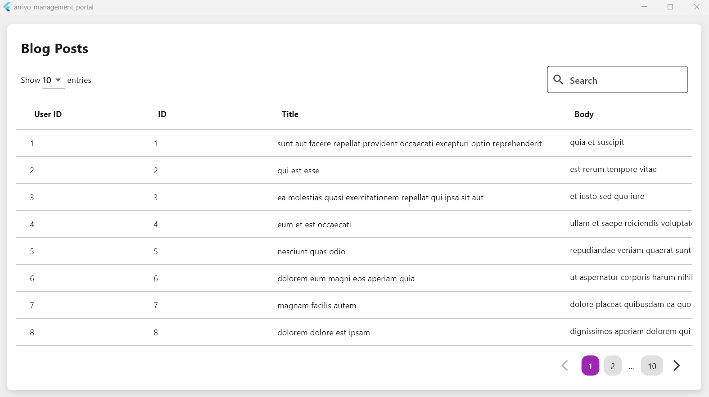

# Arrivo Technical Test - Web Application (Frontend)

This repository contains the frontend portion of the Arrivo Technical Test, specifically focused on building a management portal using Flutter for a blog post management system.

## Project Overview

The project is a web application that manages posts, categories, and users. The frontend is developed in Flutter using the flutter_bloc state management and adheres to Material Design principles.

### Key Features:
- **Blog Post List**: Displays a list of blog posts using the provided design template.
- **API Integration**: Integrated with a sample API from [jsonplaceholder](https://jsonplaceholder.typicode.com/) for blog posts and categories.
- **State Management**: Implemented using flutter_bloc to manage UI states.

## Tech Stack

- **Frontend Framework**: Flutter
- **State Management**: flutter_bloc
- **UI Design**: Material Design
- **Design Pattern**: Domain Driven Design (DDD)

## Setup and Installation

### Prerequisites:
- Flutter SDK: [Flutter installation guide](https://flutter.dev/docs/get-started/install)
- A code editor like Visual Studio Code or Android Studio

### Steps:
1. Clone the repository:
   ```bash
   git clone https://github.com/Sharran14/arrivo-management-portal.git
2. Navigate to the project directory:
   ```bash
   cd arrivo-web-app
3. Install dependencies:
   ```bash
   flutter pub get
4. Run the application:
   ```bash
   flutter run

## Usage

The web application allows users to:
- View list of blog posts (API integration with jsonplaceholder)
- Search and Change Entries of the Displayed Data

## API Integration

The frontend interacts with APIs for fetching blog posts and categories using the provided routes from [jsonplaceholder](https://jsonplaceholder.typicode.com/).

## Screenshot

Here’s a screenshots of the designed UI based on the provided template:




